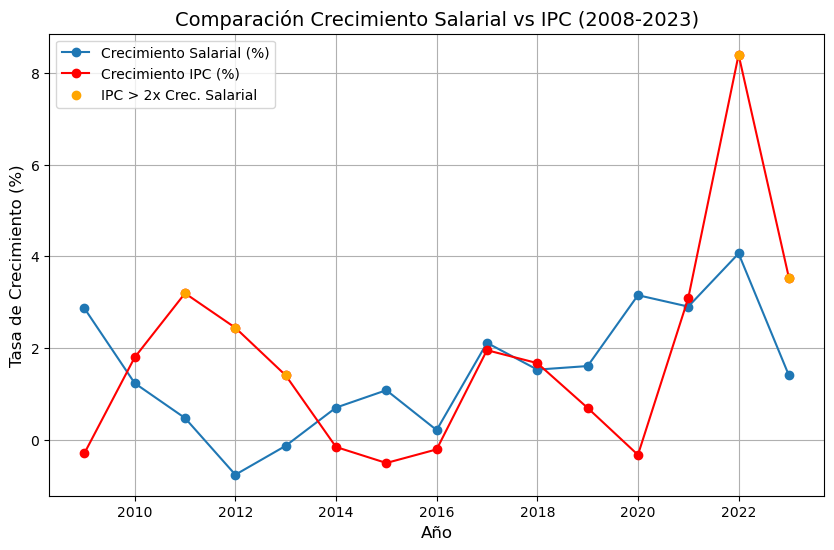
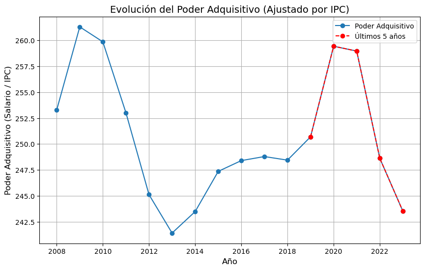
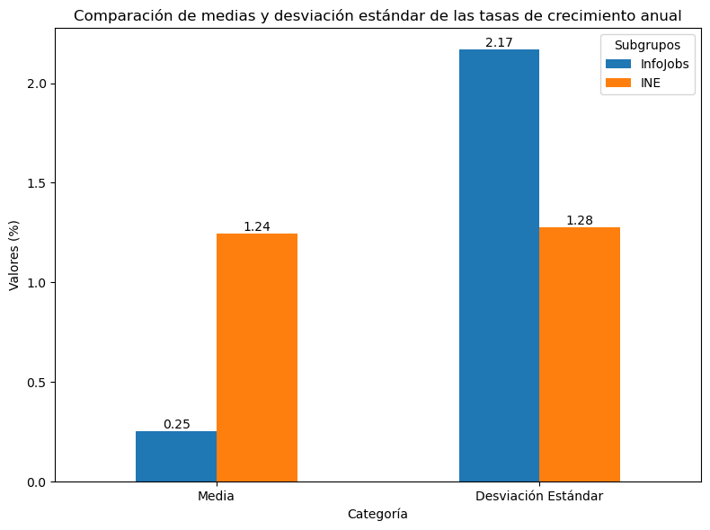
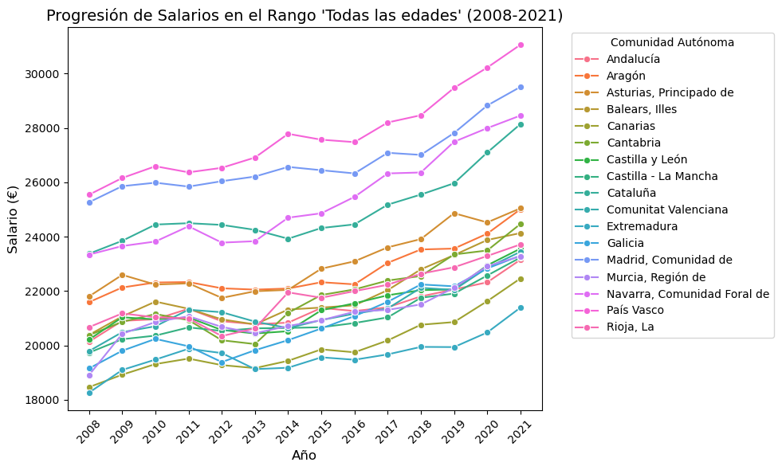
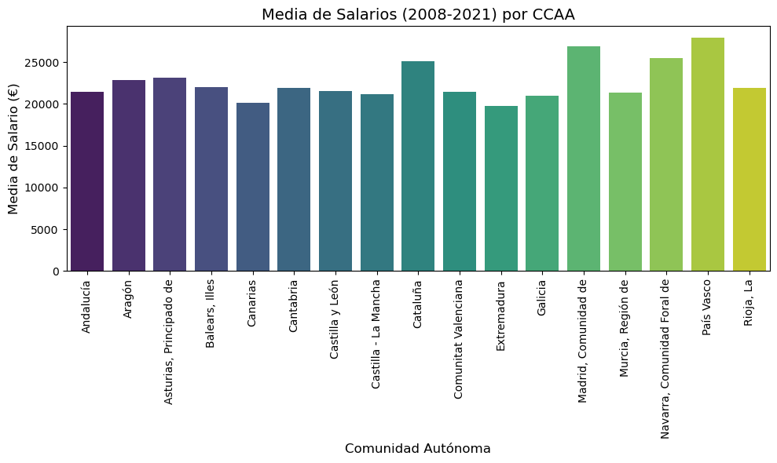
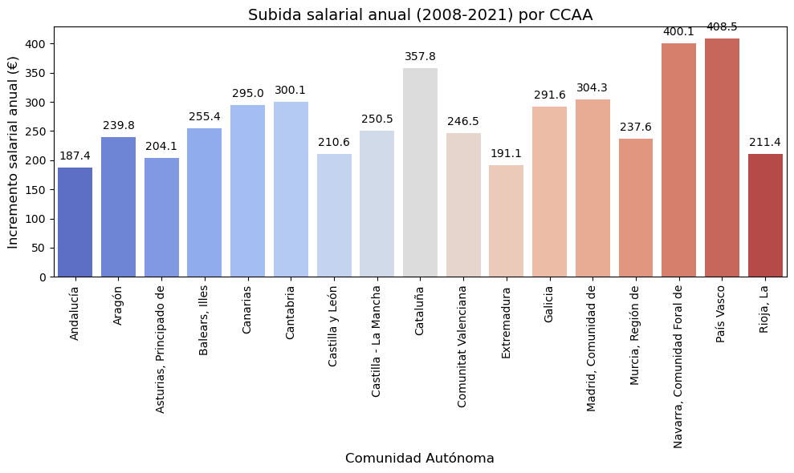
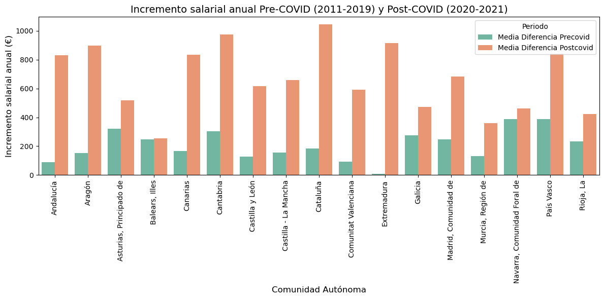
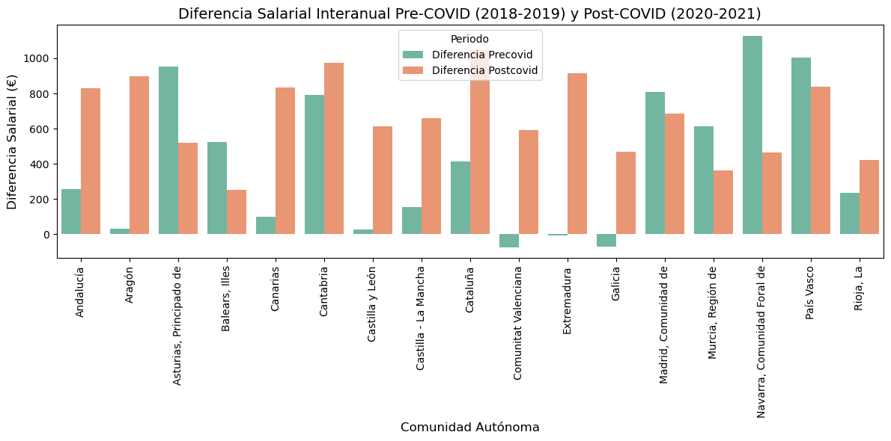

# DATA - Defensa Analítica de Transparencia en Asuntos

---

## Miembros del Proyecto

| Nombre             | Background                          | Contacto                          |
|--------------------|-------------------------------------|-----------------------------------|
| **Josemi Sánchez** | ADE y RRHH, futuro Data Analyst      | ✉️ josemiguel.sanchez4@gmail.com  |
| **Adrián Benítez** | Diseño gráfico, futuro Data Analyst  | [LinkedIn](https://www.linkedin.com/in/adrián-benítez-rueda-10102565/) |

---

## Descripción del Proyecto

**DATA** es una plataforma digital dedicada a la verificación de información (**fact-checking**) que combate la desinformación con un enfoque juvenil y entretenido.

### Misión
Desmentir *fake news* con contenido divertido y accesible en redes sociales como **TikTok**, utilizando la analítica de datos como base sólida.

### Visión
Convertirse en la fuente líder en la lucha contra la desinformación, enfocada en llegar a la **generación Z** a través de canales digitales y medios innovadores.

---

## Gráficos

Aquí puedes ver los gráficos generados durante el proyecto:

|  |  |  |  |
|-----------------------------------|-------------------------------------|-------------------------------------|-------------------------------------|
|  |  |  |  |

---

## Enlaces

- [Presentación](https://docs.google.com/presentation/d/1exNRTIUDl2MvkzlMKNybWika9kWAv_p1S7l9h6GqjoQ/edit?usp=sharing)
- [Main Notebook](https://github.com/adrianbenitezrueda/first-project-data/blob/main/main.ipynb)
- [Functions.py](https://github.com/adrianbenitezrueda/first-project-data/blob/main/functions.py)
- [Organización en Trello](https://trello.com/invite/b/66ded28d66385a3e05e905b5/ATTI9ea3af005db711fdf700621a07160ba7CB24337F/first-project)

---

¡Únete a nuestra misión y ayúdanos a crear un entorno digital más informado!